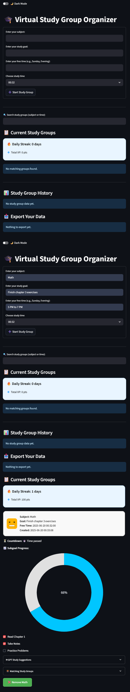

# Virtual Study Group Organizer

An AI-powered app that helps students form virtual study groups, plan collaborative sessions, track progress, and stay productive — all in one place.

Built for the PANDA x Mind The Gap Hackathon under the **Agentic AI** track.

---

## 🌟 Features

- 📅 **Group Creation & Matching**: Form study groups based on subject, topic, and schedule preferences.  
- 🧠 **Agentic GPT Assistant**: Get personalized study suggestions based on your goals.  
- ⏳ **Countdown Timers**: Real-time countdown to upcoming study sessions.  
- ✅ **Subgoal Checklist**: Break down study goals and check off progress.  
- 🌒 **Dark Mode Toggle**: Switch between light and dark modes.  
- 👥 **Avatars & Collaborators**: Display members of each group session.  
- 📊 **Productivity Charts**: Visualize your study performance with interactive charts.  
- 🕓 **Session History Tracker**: View your past sessions with timestamps.

---

## 🛠️ Tech Stack

- **Frontend/Backend**: Python with [Streamlit](https://streamlit.io/)  
- **Data Visualization**: Plotly  
- **AI Integration**: OpenAI GPT API  
- **Hosting**: Replit  
- **Storage**: In-memory session data (for now)

---

## 🤖 Agentic AI Layer

We implemented a collapsible GPT Assistant Panel that dynamically:
- Suggests effective study strategies based on subject/topic  
- Recommends subgoals and group structures  
- Supports students in taking initiative with session planning  

The assistant improves collaboration without being overly directive — empowering users to remain in control.

---

## 📷 Preview

 <!-- Optional: Upload a screenshot to your repo -->

---

## 🚀 Getting Started

### 1. Clone the Repo

```bash
git clone https://github.com/YOUR_USERNAME/Virtual_Study_Group_Organizer.git
cd Virtual_Study_Group_Organizer
```

### 2. Install Dependencies

```bash
pip install -r requirements.txt
```

### 3. Run the App

```bash
streamlit run app.py
```

---

## 🧩 Folder Structure

```
Virtual_Study_Group_Organizer/
│
├── app.py                # Main Streamlit app
├── requirements.txt      # Project dependencies
├── README.md             # You're reading it :)
```

---

## 📜 License

This project is licensed under the MIT License.  
Feel free to use, modify, or contribute!

---

## 💡 Team & Credits

Made by **Aditya Chauhan**  
Built during the PANDA x Mind The Gap Hackathon 2025

Special thanks to Replit, and Streamlit for the tools and support.

---

## 🧠 Future Plans

- Firebase integration for persistent user data  
- Email reminders and Google Calendar sync  
- Public/private study groups with invites  
- Enhanced AI coaching features
